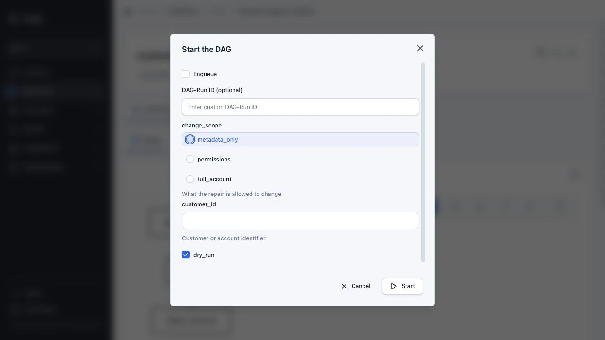
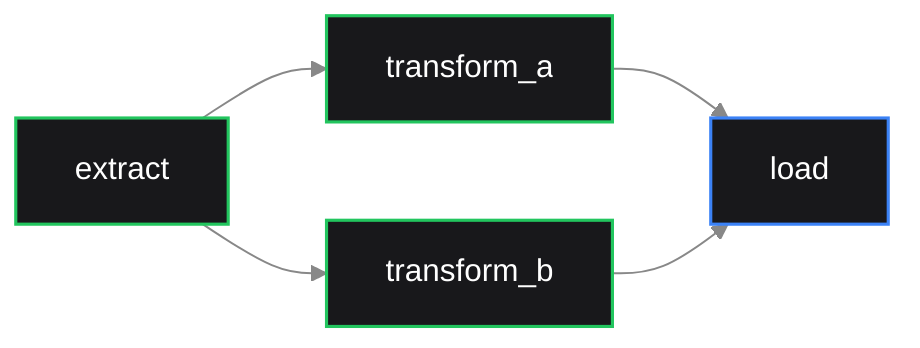

<div align="center">
  
  <p>
    <a href="https://docs.dagu.sh/overview/changelog"></a>
    <a href="https://github.com/dagucloud/dagu/actions/workflows/ci.yaml"></a>
    <a href="https://discord.gg/gpahPUjGRk"></a>
    <a href="https://bsky.app/profile/dagu-org.bsky.social"></a>
  </p>

  <p>
    <a href="https://docs.dagu.sh">Docs</a> |
    <a href="https://docs.dagu.sh/writing-workflows/examples">Examples</a> |
    <a href="https://discord.gg/gpahPUjGRk">Support & Community</a>
  </p>
</div>

## Local-first Control Plane for Existing Ops Automation and AI Agent Workflows

Define workflows in simple declarative YAML syntax, execute them anywhere with a single binary, compose complex pipelines from reusable sub-workflows, and distribute tasks across workers. The built-in Web UI eliminates the need for SSHing into servers to debug failed runs, check logs, or retry steps manually. All without requiring databases, message brokers, or code changes to your existing scripts. It natively supports command execution via SSH, running docker containers, kubernetes jobs, and you can extend it with custom step types for your specific use case.

Built for developers who want powerful workflow orchestration without the operational overhead. For a quick feel of how it works, take a look at the [examples](https://docs.daguit.dev/writing-workflows/examples).

- **Local-first and self-hosted:** One static binary; no databases, brokers, or sidecars. Battery included.
- **Language-agnostic:** No need to rewrite existing scripts.
- **AI integration:** Use your favorite AI agent through [MCP](https://docs.dagu.sh/getting-started/mcp#mcp-server) or [Skill](https://docs.dagu.sh/getting-started/ai-agent#ai-coding-tool-integration) to manage your workflows.

For a quick look at how workflows are defined, see the [examples](https://docs.dagu.sh/writing-workflows/examples).

<div align="center">
  
</div>

| Run Details | Step Logs | Documents |
|---|---|---|
|  |  |  |

**Try it live:** [Live Demo](https://dagu-demo-f5e33d0e.dagu.sh) (credentials: `demouser` / `demouser`)

## Why Dagu?

```sh
  Traditional Orchestrator          Dagu
  ┌────────────────────────┐        ┌──────────────────┐
  │  Web Server            │        │                  │
  │  Scheduler             │        │  dagu start-all  │
  │  Worker(s)             │        │                  │
  │  PostgreSQL            │        └──────────────────┘
  │  Redis / RabbitMQ      │         Single binary.
  │  Python Runtime        │         Self-hosted.
  └────────────────────────┘         Adds scheduling, retries, and approvals around existing automation.
    6+ services to manage
```

## Performance

Dagu stores state in local files. How much it can run depends on the machine and the workload. CPU, memory, disk, workflow characteristics, queue settings, and worker capacity all matter.

- **Throughput:** On one machine, Dagu can run thousands of workflow runs per day when the hardware and workflow shape fit the workload.
- **Load control:** Use [queues](https://docs.dagu.sh/server-admin/queues), concurrency limits, [resource limits](https://docs.dagu.sh/writing-workflows/dag-run-resource-limits), and optional [distributed workers](https://docs.dagu.sh/server-admin/distributed/) to decide how many runs execute at once and where they run.

## Real-World Use Cases

| Use Case | How Dagu Helps |
| --- | --- |
| ETL and data operations | Turn data extraction scripts, SQL queries, dbt commands, and data-processing runbooks into observable pipelines with durable execution. |
| Cron and legacy script management | Turn complex jobs with interdependencies into maintainable DAGs with a UI, automatic logging, retries, and notifications instead of opaque cron jobs and bash scripts. |
| Media conversion | Run `ffmpeg` for video transcoding and format conversion. Thanks to Dagu's file-backed nature, workers can run heavy conversions in parallel without single machine bottlenecks or external databases. |
| Infrastructure and server automation | Run any command or script over SSH on remote servers, keeping logs, results, and notifications in one place. |
| GitHub-driven workflows | Trigger workflows from GitHub events. This is useful for running your automation or AI agent workflows on private infrastructure without exposing your servers to the public internet. |
| Container and Kubernetes workflows | Run Docker containers and Kubernetes Jobs as steps in your workflows without building a custom control plane around containers. |
| Customer support automation | Run self-service support tools that non-engineering teams can use to run approved workflows for running diagnostics, querying databases, and performing common support tasks without escalating to engineering. |
| IoT and edge workflows | Run sensor polling, local ML inference, data preprocessing, backups, offline sync, health checks, etc. Dagu keeps these jobs close to the data source while still providing Web UI visibility. |

## Quick Start

### Install

**macOS/Linux:**

```sh
curl -fsSL https://raw.githubusercontent.com/dagucloud/dagu/main/scripts/installer.sh | bash
```

**Homebrew:**

```sh
brew install dagu
```

**Windows (PowerShell):**

```powershell
irm https://raw.githubusercontent.com/dagucloud/dagu/main/scripts/installer.ps1 | iex
```

**Docker:**

```sh
docker run --rm -v ~/.dagu:/var/lib/dagu -p 8080:8080 ghcr.io/dagucloud/dagu:latest dagu start-all
```

**Kubernetes (Helm):**

```sh
helm repo add dagu https://dagucloud.github.io/dagu
helm repo update
helm install dagu dagu/dagu --set persistence.storageClass=<your-rwx-storage-class>
```

> Replace `<your-rwx-storage-class>` with a StorageClass that supports `ReadWriteMany`. See [charts/dagu/README.md](./charts/dagu/README.md) for chart configuration.

The script installers run a guided wizard that can add Dagu to your PATH, set it up as a background service, and create the initial admin account. Homebrew, npm, Docker, and Helm install without the wizard. See [Installation docs](https://docs.dagu.sh/getting-started/installation) for all options.

### Create and run a workflow

Create `hello.yaml`:

```yaml
steps:
  - id: hello
    run: echo "hello from Dagu"
```

Run the workflow with:

```sh
dagu start hello.yaml
```

### Start the server

```sh
dagu start-all
```

Visit http://localhost:8080

### Connect AI agents through MCP

Dagu exposes a built-in MCP server from the running HTTP server. Start Dagu, then configure MCP-capable chat or coding agents to use the Streamable HTTP endpoint:

```text
http://localhost:8080/mcp
```

Use MCP when you want an AI agent to read Dagu state, preview or apply workflow changes, and start, enqueue, retry, or stop runs through `dagu_read`, `dagu_change`, and `dagu_execute`. See the [MCP setup guide](https://docs.dagu.sh/getting-started/mcp).

For authoring-only help in Claude Code, Codex, Gemini CLI, and other AI coding tools, install the Dagu workflow authoring skill:

```sh
gh skill install dagucloud/dagu dagu
```

## How You Run Dagu?

Run Dagu on one machine, scale out with distributed workers, or use a managed Dagu instance operated by us. See the [Deployment Models guide](https://docs.dagu.sh/overview/deployment-models).

<table>
  <tr>
    <td width="50%" align="center" valign="top">
      <strong>Local Single-Server</strong><br>
      
    </td>
    <td width="50%" align="center" valign="top">
      <strong>Self-Hosted</strong><br>
      
    </td>
  </tr>
  <tr>
    <td width="50%" align="center" valign="top">
      <strong>Managed Server</strong><br>
      
    </td>
    <td width="50%" align="center" valign="top">
      <strong>Hybrid</strong><br>
      
    </td>
  </tr>
</table>

| Model | Server | Execution | Best for |
|------|--------|-----------|----------|
| **Local single-server** | `dagu start-all` on one machine. | Same machine. | Development, small scheduled workloads, edge jobs, and simple internal automation. |
| **Self-hosted** | Dagu server on your infrastructure. | Local execution or distributed workers on your infrastructure. | Teams that need ownership of infrastructure. |
| **Managed Server** | Full managed Dagu server in a dedicated, isolated gVisor instance on GKE. | Managed instance. | Teams that want Dagu operated for them without running the server themselves. |
| **Hybrid** | Full managed Dagu Cloud server. | Private workers in your infrastructure over mTLS. | Docker steps, private networks, specialized hardware, or data-local work. |

### Licensing

- **Community self-host:** No license key required. You operate the server, storage, upgrades, networking, and workers. Start with the [installation guide](https://docs.dagu.sh/getting-started/installation/).
- **Self-host license:** Adds SSO, RBAC, audit logging, and incident SaaS integration to Dagu. See [self-host licensing](https://dagu.sh/pricing#self-host).
- **Dagu managed instance:** Includes its own managed license. Private workers can run on your infrastructure.

Managed Dagu instances do not expose a Docker daemon or Docker socket. Workflows that need Docker step execution should use self-hosted Dagu or a private worker with Docker access.

## Key Features

- **Observability:** Shared workflows and scheduling with clear visualizations, status tracking, and logs in the Web UI.
- **Language-agnostic:** No framework required. Define workflow steps using [shell commands](https://docs.dagu.sh/step-types/shell), Docker containers, Kubernetes Jobs, SQL queries, HTTP requests, and any other tool via [official](https://docs.dagu.sh/dagu-actions/official) and [third-party Dagu Actions](https://docs.dagu.sh/dagu-actions/third-party).
- **Reproducibility:** Reproducible runs with [pinned tools](https://docs.dagu.sh/writing-workflows/tools), plus automatic installation and caching on workers—eliminating the need to manually install dependencies on the server or workers.
- **Multiplayer Agent:** Shared [AI agents](https://docs.dagu.sh/features/agent/) integrated into workflows, the Web UI, and chat tools (Slack, Telegram, Discord, etc.).
- **Built-in Approvals:** The [Human-in-the-loop steps](https://docs.dagu.sh/writing-workflows/approval#approval) for manual approvals, review, and intervention in any workflow.
- **MCP Server:** Built-in [MCP server](https://docs.dagu.sh/mcp/) for authoring and running workflows via AI agents like Claude Code, Codex, Gemini CLI, Pi, OpenCode, and more.
- **Harness-agnostic:** You can run any coding agent (Claude Code, Codex, Gemini CLI, Pi, OpenCode, etc.) with a built-in [harness](https://docs.dagu.sh/step-types/harness/) action.
- **Secret management:** Built-in [secret management](https://docs.dagu.sh/web-ui/secrets) with secure log masking, preventing credentials from leaking to AI agents or the Web UI.
- **Self-host or managed:** Self-hosted via a single binary that runs on Linux, macOS, and Windows. Includes an optional distributed worker mode for scaling out execution across machines.
- **Permission Control:** [RBAC and SSO support](https://docs.dagu.sh/server-admin/authentication/builtin) for team environments, controlling who can view, run, and edit workflows through granular permissions and audit logging.

## Architecture

Dagu can run in three configurations:

**Standalone:** A single `dagu start-all` process runs the HTTP server, scheduler, and executor. Suitable for single-machine deployments.

**Coordinator/Worker:** The scheduler enqueues jobs to a local file-based queue, then dispatches them to a coordinator over gRPC. Workers long-poll the coordinator for tasks, execute DAGs locally, and report status back. Workers can run on separate machines and are routed tasks based on labels.

**Headless:** Run without the web UI (`DAGU_HEADLESS=true`). Useful for CI/CD environments or when Dagu is managed through the CLI or API only.

```sh
Standalone:

  ┌─────────────────────────────────────────┐
  │  dagu start-all                         │
  │  ┌───────────┐ ┌───────────┐ ┌────────┐ │
  │  │ HTTP / UI │ │ Scheduler │ │Executor│ │
  │  └───────────┘ └───────────┘ └────────┘ │
  │  File-based storage (logs, state, queue)│
  └─────────────────────────────────────────┘

Distributed:

  ┌────────────┐                   ┌────────────┐
  │ Scheduler  │                   │ HTTP / UI  │
  │            │                   │            │
  │ ┌────────┐ │                   └─────┬──────┘
  │ │ Queue  │ │  Dispatch (gRPC)        │ Dispatch / GetWorkers
  │ │(file)  │ │─────────┐               │ (gRPC)
  │ └────────┘ │         │               │
  └────────────┘         ▼               ▼
                    ┌─────────────────────────┐
                    │      Coordinator        │
                    │  ┌───────────────────┐  │
                    │  │ Dispatch Task     │  │
                    │  │ Store (pending/   │  │
                    │  │ claimed)          │  │
                    │  └───────────────────┘  │
                    └────────▲────────────────┘
                             │
                   Worker poll / task response
                   Heartbeat / ReportStatus /
                   StreamLogs (gRPC)
                             │
               ┌─────────────┴─────────────┐
               │             │             │
          ┌────┴───┐    ┌────┴───┐    ┌────┴───┐
          │Worker 1│    │Worker 2│    │Worker N│ Sandbox execution of DAGs
          │        │    │        │    │        │
          └────────┘    └────────┘    └────────┘
```

## Parameter Definition

Workflows can define parameters that render as typed input forms in the Web UI and can be passed as environment variables to steps.

```yaml
params:
  - id: extract
    run: ./scripts/extract.sh > data/raw.json
    retry_policy:
      limit: 3
      interval_sec: 30

  - name: customer_id
    type: string
    description: Customer or account identifier

  - name: change_scope
    type: string
    description: What the repair is allowed to change
    enum:
      - metadata_only
      - permissions
      - full_account
    default: metadata_only
  - name: dry_run
    type: boolean
    default: true
```

<div align="center">
  
</div>

## Workflow Examples

### Parallel executions

```yaml
steps:
  - id: extract
    run: ./extract.sh

  - id: transform_a
    run: ./transform_a.sh
    depends: extract

  - id: transform_b
    run: ./transform_b.sh
    depends: extract

  - id: load
    run: ./load.sh
    depends: [transform_a, transform_b]
```



### External tools with pinning and caching

```yaml
tools:
  - jqlang/jq@jq-1.7.1

steps:
  - id: inspect
    run: jq --version

  - id: summarize
    action: python-script@v1
    with:
      input:
        rows: [42, 8]
      script: |
        return {"total": sum(input["rows"])}
```

Dagu installs declared portable CLIs before the DAG run, exposes them on `PATH` for host command steps, and caches them on each worker. Tool provisioning uses [aqua](https://aquaproj.github.io/) as the default provider. See the [Tools documentation](https://docs.dagu.sh/writing-workflows/tools) and [Dagu Actions](https://docs.dagu.sh/dagu-actions/) for more details.

### Third-party Dagu Actions

```yaml
steps:
  - id: notify
    action: acme/dagu-action-notify@v1.2.0
    with:
      text: "Build ${BUILD_ID} finished"

  - id: audit
    depends: notify
    run: echo "Notification result: ${notify.outputs.messageId}"
```

A third-party Dagu Action package contains a DAG, manifest, schemas, and helper files behind an `action:` reference. See the [Dagu Actions](https://docs.dagu.sh/dagu-actions/) and [Third-Party Actions](https://docs.dagu.sh/dagu-actions/third-party) documentation for details.

### Docker step

```yaml
steps:
  - name: build
    container:
      image: node:20-alpine
    run: npm run build
```

### Kubernetes Pod execution

```yaml
steps:
  - name: batch-job
    action: kubernetes.run
    with:
      namespace: production
      image: my-registry/batch-processor:latest
      resources:
        requests:
          cpu: "2"
          memory: "4Gi"
      command: ./process.sh
```

### SSH remote execution

```yaml
steps:
  - name: deploy
    action: ssh.run
    with:
      host: prod-server.example.com
      user: deploy
      key: ~/.ssh/id_rsa
      command: cd /var/www && git pull && systemctl restart app
```

### Sub-DAG composition

```yaml
steps:
  - name: extract
    action: dag.run
    with:
      dag: etl/extract
      params:
        SOURCE: s3://bucket/data.csv

  - name: transform
    action: dag.run
    with:
      dag: etl/transform
      params:
        INPUT: ${extract.outputs.result}
    depends: extract

  - name: load
    action: dag.run
    with:
      dag: etl/load
      params:
        DATA: ${transform.outputs.result}
    depends: transform

---

# You can include multiple DAGs in the same YAML file, or reference DAGs defined in separate files.
name: etl/extract

tools:
  - aws/aws-cli@2.11.14

steps:
  - name: download
    run: aws s3 cp ${SOURCE} data.csv
    outputs:
      result: data.csv
```

### Retry and error handling

```yaml
steps:
  - name: flaky-api-call
    run: curl -f https://api.example.com/data
    retry_policy:
      limit: 3
      interval_sec: 10
    continue_on:
      failure: true
```

### Scheduling with overlap control and catch-up

```yaml
schedule:
  - "0 */6 * * *"          # Every 6 hours
overlap_policy: skip       # Skip if previous run is still active
catchup_window: "5h"       # Catch up missed runs when scheduler is down for up to 5 hours
  
timeout_sec: 3600
handler_on:
  failure:
    run: notify-team.sh
  exit:
    run: cleanup.sh
```

### Built-in agent step with manual approval

```yaml
steps:
  - id: review
    action: agent.run
    with:
      task: Review the README.md file and return concise Markdown findings.
      max_iterations: 10
    stdout:
      artifact: review.md

  - id: approval
    action: noop
    depends: review
    approval:
      prompt: Review the review.md artifact. Approve to post an issue with the findings, or reject to skip.

  - id: read_review
    action: artifact.read
    depends: approval
    with:
      path: review.md

  - id: post_issue
    run: gh issue create --title "Review Findings" --body-file "${read_review.stdout}"
    depends: read_review
```

For more examples, see the [Examples documentation](https://docs.dagu.sh/writing-workflows/examples).

## Built-in Actions

Dagu includes built-in actions that run within the Dagu process or on the selected worker. Local shell commands use the [`run:` field](https://docs.dagu.sh/step-types/shell); structured work uses `action:`.

| Action | Purpose |
|----------|---------|
| [`run:` field](https://docs.dagu.sh/step-types/shell) | Local shell commands and scripts (bash, sh, PowerShell, custom shells) |
| [`exec`](https://docs.dagu.sh/writing-workflows/yaml-specification#built-in-action-names) | Direct process execution without shell parsing |
| [`noop`](https://docs.dagu.sh/writing-workflows/yaml-specification#built-in-action-names) | Output-only or approval-only placeholder step |
| [`log.write`](https://docs.dagu.sh/step-types/log) | Write structured log messages |
| [`docker.run`](https://docs.dagu.sh/step-types/docker) / `container.run` | Run containers with registry auth, volume mounts, and resource limits |
| [`kubernetes.run` / `k8s.run`](https://docs.dagu.sh/step-types/kubernetes) | Execute Kubernetes Jobs with namespace, image, and resource settings |
| [`ssh.run`](https://docs.dagu.sh/step-types/ssh) | Remote command execution over SSH |
| [`sftp.upload` / `sftp.download`](https://docs.dagu.sh/step-types/sftp) | File transfer over SFTP |
| [`http.request`](https://docs.dagu.sh/step-types/http) | HTTP requests with headers, auth, and request bodies |
| [`chat.completion`](https://docs.dagu.sh/writing-workflows/yaml-specification#built-in-action-names) | Run an LLM chat completion step |
| [`harness.run`](https://docs.dagu.sh/step-types/harness) | Run coding agent CLIs such as Claude Code, Codex, Copilot, OpenCode, and Pi |
| [`agent.run`](https://docs.dagu.sh/features/agent/step) | Built-in agent action with tool use |
| [`postgres.query` / `postgres.import`](https://docs.dagu.sh/step-types/sql/postgresql) | PostgreSQL queries and imports |
| [`sqlite.query` / `sqlite.import`](https://docs.dagu.sh/step-types/sql/sqlite) | SQLite queries and imports |
| [`redis.<operation>`](https://docs.dagu.sh/step-types/redis) | Redis commands, pipelines, and Lua scripts |
| [`s3.upload` / `s3.download` / `s3.list` / `s3.delete`](https://docs.dagu.sh/step-types/s3) | Upload, download, list, and delete S3 objects |
| [`file.stat` / `file.read` / `file.write` / `file.copy` / `file.move` / `file.delete` / `file.mkdir` / `file.list`](https://docs.dagu.sh/writing-workflows/yaml-specification#built-in-action-names) | Local file operations without shell commands |
| [`artifact.write` / `artifact.read` / `artifact.list`](https://docs.dagu.sh/step-types/artifact) | Write, read, and list DAG-run artifacts |
| [`data.convert` / `data.pick`](https://docs.dagu.sh/step-types/data) | Convert and select structured data |
| [`jq.filter`](https://docs.dagu.sh/step-types/jq) | JSON transformation using jq expressions |
| [`archive.create` / `archive.extract` / `archive.list`](https://docs.dagu.sh/step-types/archive) | Create, extract, and list zip/tar archives |
| [`wait.duration` / `wait.until` / `wait.file` / `wait.http`](https://docs.dagu.sh/step-types/wait) | Wait for time, file state, or HTTP readiness |
| [`mail.send`](https://docs.dagu.sh/step-types/mail) | Send email via SMTP |
| [`template.render`](https://docs.dagu.sh/step-types/template) | Text generation with template rendering |
| [`router.route`](https://docs.dagu.sh/step-types/router) | Conditional step routing based on values and patterns |
| [`dag.run`](https://docs.dagu.sh/writing-workflows/control-flow) | Invoke another DAG as a sub-workflow with params and dependencies |
| [`dag.enqueue`](https://docs.dagu.sh/writing-workflows/control-flow) | Queue another DAG asynchronously and continue after enqueue |
| [`git.checkout`](https://docs.dagu.sh/step-types/git) | Clone or update Git repositories |
| [`outputs.write`](https://docs.dagu.sh/step-types/outputs) | Publish DAG or Dagu Action outputs for callers |

## Custom Actions

Custom Actions are inline reusable wrappers defined with the top-level `actions` field. They expand to built-in actions during DAG load, so you can wrap a common shell, HTTP, SQL, or other pattern behind a typed interface with validated input.

```yaml
actions:
  webhook.send:
    input_schema:
      type: object
      additionalProperties: false
      required: [url, text]
      properties:
        url:
          type: string
        text:
          type: string
    template:
      action: http.request
      with:
        method: POST
        url: {{ .input.url }}
        headers:
          Content-Type: application/json
        body: |
          {"text": {{ json .input.text }}}

steps:
  - action: webhook.send
    with:
      url: https://hooks.example.com/ops
      text: deploy complete
```

See [Custom Actions](https://docs.dagu.sh/dagu-actions/custom) and the [YAML Specification](https://docs.dagu.sh/writing-workflows/yaml-specification) for the exact `actions`, `action`, and `run` field behavior.

## Official Dagu Actions

Dagu Actions are official action packages maintained in the `dagucloud` GitHub organization. They use the same action package runtime as third-party action packages, but callers use the short form `action: name@version`.

| Dagu Action | Purpose |
|-------------|---------|
| [`node-script@v1`](https://docs.dagu.sh/dagu-actions/official/node-script) | Run small JavaScript transforms or glue code with action-owned Node.js |
| [`python-script@v1`](https://docs.dagu.sh/dagu-actions/official/python-script) | Run small Python transforms or glue code with action-owned Python and optional requirements |
| [`dbt@v1`](https://docs.dagu.sh/dagu-actions/official/dbt) | Run dbt Core commands with action-owned Python and adapter requirements |
| [`duckdb@v1`](https://docs.dagu.sh/dagu-actions/official/duckdb) | Run DuckDB SQL through the DuckDB CLI without adding DuckDB to the core binary |
| [`ffmpeg@v1`](https://docs.dagu.sh/dagu-actions/official/ffmpeg) | Run FFmpeg conversion, transcoding, probing, and stream-processing tasks |
| [`github-cli@v1`](https://docs.dagu.sh/dagu-actions/official/github-cli) | Run GitHub issue, pull request, release, repository, and API automation through `gh` |
| [`rclone@v1`](https://docs.dagu.sh/dagu-actions/official/rclone) | Run portable copy, sync, check, list, and storage-management workflows through rclone |

Versions are required. Pin production workflows to a version tag or commit SHA. See [Official Dagu Actions](https://docs.dagu.sh/dagu-actions/official) for the current Dagu Action list and exact input/output contracts.

For non-official packages, use Third-Party Actions such as `action: owner/repo@version`. They contain a `dagu-action.yaml` manifest and a DAG entrypoint, run as sub-DAGs, and are transferred to distributed workers as workspace bundles after the reference is resolved. See [Third-Party Actions](https://docs.dagu.sh/dagu-actions/third-party) for package layout and reference formats.

## Security and Access Control

### Authentication

Dagu supports three top-level authentication modes, configured via `DAGU_AUTH_MODE`:

- **`none`** — No authentication
- **`basic`** — HTTP Basic authentication
- **`builtin`** — JWT-based authentication with user management, API keys, per-DAG webhook tokens, and optional OIDC/SSO integration

### Role-Based Access Control

When using `builtin` auth, five roles control access:

| Role | Capabilities |
|------|-------------|
| `admin` | Full access including user management |
| `manager` | Create, edit, delete, run, stop DAGs; view audit logs |
| `developer` | Create, edit, delete, run, stop DAGs |
| `operator` | Run and stop DAGs only (no editing) |
| `viewer` | Read-only access |

API keys can be created with independent role assignments. Audit logging tracks all actions.

### TLS and Secrets

- TLS for the HTTP server (`DAGU_CERT_FILE`, `DAGU_KEY_FILE`)
- Mutual TLS for gRPC coordinator/worker communication (`DAGU_PEER_CERT_FILE`, `DAGU_PEER_KEY_FILE`, `DAGU_PEER_CLIENT_CA_FILE`)
- Secret management with three providers: environment variables, files, and [HashiCorp Vault](https://www.vaultproject.io/)

### Production Hardening

For self-hosted production deployments, treat network exposure and execution boundaries as the primary controls:

- Prefer `auth.mode: builtin` for any shared or network-exposed instance. Use `basic` only for simple private setups, and avoid `none` outside isolated local development.
- Keep `metrics: private` unless the metrics endpoint is reachable only on a trusted private network.
- Bind Dagu to loopback or a private interface when possible. If you must use `0.0.0.0`, place it behind a trusted reverse proxy, TLS, and network-level access controls.
- Leave `terminal.enabled: false` unless the instance is admin-only and tightly scoped.
- In distributed deployments, set `peer.insecure=false` and configure peer TLS when coordinator and workers communicate across host or network boundaries.
- Treat Docker socket mounts, root containers, and host-level executors as privileged access to the underlying machine.

See [Server Configuration](https://docs.dagu.sh/server-admin/server), [Docker deployment](https://docs.dagu.sh/server-admin/deployment/docker), and [Distributed execution](https://docs.dagu.sh/server-admin/distributed/) for the operator-focused guidance.

## Observability

### Prometheus Metrics

Dagu exposes Prometheus-compatible metrics:

- `dagu_info` — Build information (version, Go version)
- `dagu_uptime_seconds` — Server uptime
- `dagu_dag_runs_total` — Total DAG runs by status
- `dagu_dag_runs_total_by_dag` — Per-DAG run counts
- `dagu_dag_run_duration_seconds` — Histogram of run durations
- `dagu_dag_runs_currently_running` — Active DAG runs
- `dagu_dag_runs_queued_total` — Queued runs
- `dagu_workers_registered` — Registered distributed workers
- `dagu_worker_info` — Worker heartbeat labels as key/value metadata
- `dagu_worker_heartbeat_timestamp_seconds` — Last worker heartbeat timestamp
- `dagu_worker_health_status` — Worker health by heartbeat freshness
- `dagu_worker_pollers` — Worker poller capacity by state
- `dagu_worker_running_tasks` — Running tasks per worker
- `dagu_worker_oldest_running_task_age_seconds` — Age of the oldest running task per worker

### Structured Logging

JSON or text format logging (`DAGU_LOG_FORMAT`). Logs are stored per-run with separate stdout/stderr capture per step.

### Notifications

- Slack and Telegram bot integration for run monitoring and status updates
- Email notifications on DAG success, failure, or wait status via SMTP
- Per-DAG webhook endpoints with token authentication

## Artifacts


Dagu runs can write arbitrary files into `DAG_RUN_ARTIFACTS_DIR`, and Dagu stores them per run as [Artifacts](https://docs.dagu.sh/writing-workflows/artifacts). In the [Web UI](https://docs.dagu.sh/overview/web-ui), operators can browse the file tree, preview Markdown, text, and image files inline, and download any artifact when they need the raw file.

This is useful for generated reports, screenshots, charts, exported JSON or CSV files, and other outputs that do not fit simple key/value [outputs](https://docs.dagu.sh/writing-workflows/outputs).

See the [Artifacts documentation](https://docs.dagu.sh/writing-workflows/artifacts) and the [Web UI guide](https://docs.dagu.sh/overview/web-ui) for the full artifact browser workflow and screenshots.

## Scheduling and Reliability

- **Cron scheduling** with timezone support and multiple schedule entries per DAG
- **Overlap policies**: `skip` (default — skip if previous run is still active), `all` (queue all), `latest` (keep only the most recent)
- **Catch-up scheduling**: Automatically runs missed intervals when the scheduler was down
- **Zombie detection**: Identifies and handles stalled DAG runs (configurable interval, default 45s)
- **Retry policies**: Per-step retry with configurable limits, intervals, and exit code filtering
- **Lifecycle hooks**: `onInit`, `onSuccess`, `onFailure`, `onAbort`, `onExit`, `onWait`
- **Preconditions**: Gate DAG or step execution on shell command results
- **High availability**: Scheduler lock with stale detection for failover

## Distributed Execution

The coordinator/worker architecture distributes DAG execution across multiple machines:

- **Coordinator**: gRPC server that manages task distribution, worker registry, and health monitoring
- **Workers**: Connect to the coordinator, pull tasks from the queue, execute DAGs locally, report results
- **Worker labels**: Route DAGs to specific workers based on labels (e.g., `gpu=true`, `region=us-east-1`)
- **Health checks**: HTTP health endpoints on coordinator and workers for load balancer integration
- **Queue system**: File-based persistent queue with configurable concurrency limits

```sh
# Start coordinator
dagu coordinator

# Start workers (on separate machines)
DAGU_WORKER_LABELS=gpu=true,memory=64G dagu worker
```

See the [distributed execution documentation](https://docs.dagu.sh/server-admin/distributed/) for setup details.

## CLI Reference

| Command | Description |
|---------|-------------|
| `dagu start <dag>` | Execute a DAG |
| `dagu start-all` | Start HTTP server + scheduler + coordinator |
| `dagu server` | Start HTTP server only |
| `dagu scheduler` | Start scheduler only |
| `dagu coordinator` | Start coordinator (distributed mode) |
| `dagu worker` | Start worker (distributed mode) |
| `dagu stop <dag>` | Stop a running DAG |
| `dagu restart <dag>` | Restart a DAG |
| `dagu retry --run-id=<run-id> <dag>` | Retry a failed run |
| `dagu dry <dag>` | Dry run — show what would execute |
| `dagu status <dag>` | Show DAG run status |
| `dagu history <dag>` | Show execution history |
| `dagu validate <dag>` | Validate DAG YAML |
| `dagu enqueue <dag>` | Add DAG to the execution queue |
| `dagu dequeue <queue-name> [--dag-run=<dag>:<run-id>]` | Remove a DAG-run from the queue |
| `dagu cleanup <dag>` | Clean up old run data |
| `dagu migrate history` | Migrate legacy run history |
| `dagu version` | Show version |

## Environment Variables

**Precedence:** Command-line flags > Environment variables > Configuration file (`~/.config/dagu/config.yaml`)

## Embedded Go API (Experimental)

Go applications can import Dagu and start DAG runs from the host process:

```go
import "github.com/dagucloud/dagu"
```

```go
engine, err := dagu.New(ctx, dagu.Options{
	HomeDir: "/var/lib/myapp/dagu",
})
if err != nil {
	return err
}
defer engine.Close(context.Background())

run, err := engine.RunYAML(ctx, []byte(`
params:
  - MESSAGE
steps:
  - name: hello
    run: echo "${MESSAGE}"
`), dagu.WithParams(map[string]string{
	"MESSAGE": "hello from the host app",
}))
if err != nil {
	return err
}

status, err := run.Wait(ctx)
if err != nil {
	return err
}
fmt.Println(status.Status)
```

The embedded API is experimental and may change. See the [embedded API documentation](https://docs.dagu.sh/embedding/go-api) and [examples/embedded](./examples/embedded).

### Server

| Variable | Default | Description |
|----------|---------|-------------|
| `DAGU_HOST` | `127.0.0.1` | Bind address |
| `DAGU_PORT` | `8080` | HTTP port |
| `DAGU_BASE_PATH` | — | Base path for reverse proxy |
| `DAGU_HEADLESS` | `false` | Run without web UI |
| `DAGU_TZ` | — | Timezone (e.g., `Asia/Tokyo`) |
| `DAGU_LOG_FORMAT` | `text` | `text` or `json` |
| `DAGU_CERT_FILE` | — | TLS certificate |
| `DAGU_KEY_FILE` | — | TLS private key |

### Paths

| Variable | Default | Description |
|----------|---------|-------------|
| `DAGU_HOME` | — | Overrides all path defaults |
| `DAGU_DAGS_DIR` | `~/.config/dagu/dags` | DAG definitions directory |
| `DAGU_LOG_DIR` | `~/.local/share/dagu/logs` | Log files |
| `DAGU_DATA_DIR` | `~/.local/share/dagu/data` | Application state |
| `DAGU_TOOLS_DIR` | `{DAGU_DATA_DIR}/tools` | Managed DAG tool cache |

### Authentication

| Variable | Default | Description |
|----------|---------|-------------|
| `DAGU_AUTH_MODE` | `builtin` | `none`, `basic`, or `builtin` |
| `DAGU_AUTH_BASIC_USERNAME` | — | Basic auth username |
| `DAGU_AUTH_BASIC_PASSWORD` | — | Basic auth password |
| `DAGU_AUTH_TOKEN_SECRET` | (auto) | JWT signing secret |
| `DAGU_AUTH_TOKEN_TTL` | `24h` | JWT token lifetime |

OIDC variables: `DAGU_AUTH_OIDC_CLIENT_ID`, `DAGU_AUTH_OIDC_CLIENT_SECRET`, `DAGU_AUTH_OIDC_ISSUER`, `DAGU_AUTH_OIDC_SCOPES`, `DAGU_AUTH_OIDC_WHITELIST`, `DAGU_AUTH_OIDC_AUTO_SIGNUP`, `DAGU_AUTH_OIDC_DEFAULT_ROLE`, `DAGU_AUTH_OIDC_ALLOWED_DOMAINS`.

### Scheduler

| Variable | Default | Description |
|----------|---------|-------------|
| `DAGU_SCHEDULER_PORT` | `8090` | Health check port |
| `DAGU_SCHEDULER_ZOMBIE_DETECTION_INTERVAL` | `45s` | Zombie run detection interval (`0` to disable) |
| `DAGU_SCHEDULER_LOCK_STALE_THRESHOLD` | `30s` | HA lock stale threshold |
| `DAGU_QUEUE_ENABLED` | `true` | Enable queue system |

### Coordinator / Worker

| Variable | Default | Description |
|----------|---------|-------------|
| `DAGU_COORDINATOR_HOST` | `127.0.0.1` | Coordinator bind address |
| `DAGU_COORDINATOR_PORT` | `50055` | Coordinator gRPC port |
| `DAGU_COORDINATOR_HEALTH_PORT` | `8091` | Coordinator health check port |
| `DAGU_WORKER_ID` | — | Worker instance ID |
| `DAGU_WORKER_MAX_ACTIVE_RUNS` | `100` | Max concurrent runs per worker |
| `DAGU_WORKER_HEALTH_PORT` | `8092` | Worker health check port |
| `DAGU_WORKER_LABELS` | — | Worker labels (`key=value,key=value`) |

### Peer TLS (gRPC)

| Variable | Default | Description |
|----------|---------|-------------|
| `DAGU_PEER_CERT_FILE` | — | Peer TLS certificate |
| `DAGU_PEER_KEY_FILE` | — | Peer TLS private key |
| `DAGU_PEER_CLIENT_CA_FILE` | — | CA for client verification |
| `DAGU_PEER_INSECURE` | `true` | Use h2c instead of TLS |

### Git Sync

| Variable | Default | Description |
|----------|---------|-------------|
| `DAGU_GITSYNC_ENABLED` | `false` | Enable Git sync |
| `DAGU_GITSYNC_REPOSITORY` | — | Repository URL |
| `DAGU_GITSYNC_BRANCH` | `main` | Branch to sync |
| `DAGU_GITSYNC_AUTH_TYPE` | `token` | `token` or `ssh` |
| `DAGU_GITSYNC_AUTOSYNC_ENABLED` | `false` | Enable periodic auto-pull |
| `DAGU_GITSYNC_AUTOSYNC_INTERVAL` | `300` | Sync interval in seconds |

Full configuration reference: [docs.dagu.sh/server-admin/reference](https://docs.dagu.sh/server-admin/reference)

## Documentation

- [Getting Started](https://docs.dagu.sh/getting-started/installation) — Installation and first workflow
- [Writing Workflows](https://docs.dagu.sh/writing-workflows/examples) — YAML syntax, scheduling, execution control
- [Workflow Schema at a Glance](./README_SCHEMA.md) — Repository-level overview of the current YAML schema
- [Tools](https://docs.dagu.sh/writing-workflows/tools) — Pin external CLI packages in DAGs for reproducible host command steps
- [Built-in Actions](https://docs.dagu.sh/step-types/shell) — [Shell](https://docs.dagu.sh/step-types/shell), [Docker](https://docs.dagu.sh/step-types/docker), [Kubernetes](https://docs.dagu.sh/step-types/kubernetes), [HTTP](https://docs.dagu.sh/step-types/http), [SQL](https://docs.dagu.sh/step-types/sql/), [Harness](https://docs.dagu.sh/step-types/harness), and [Agent Step](https://docs.dagu.sh/features/agent/step)
- [Custom Actions](https://docs.dagu.sh/dagu-actions/custom) — Inline `actions:` wrappers around built-in actions
- [Dagu Actions](https://docs.dagu.sh/dagu-actions/official) — Official `dagucloud/*` action packages such as `duckdb@v1`, `python-script@v1`, and `github-cli@v1`
- [Distributed Execution](https://docs.dagu.sh/server-admin/distributed/) — Coordinator/worker setup
- [Authentication](https://docs.dagu.sh/server-admin/authentication/) — RBAC, OIDC, API keys
- [Git Sync](https://docs.dagu.sh/server-admin/git-sync) — Version-controlled DAG definitions
- [GitHub Integration](https://docs.dagu.sh/github-integration/) — Trigger Dagu runs from GitHub events, PR comments, releases, checks, and dispatches
- [AI Agent](https://docs.dagu.sh/features/agent/) — AI-assisted workflow authoring
- [Changelog](https://docs.dagu.sh/overview/changelog)

## Community

- [Discord](https://discord.gg/gpahPUjGRk) — Questions and discussion
- [GitHub Issues](https://github.com/dagucloud/dagu/issues) — Bug reports and feature requests
- [Bluesky](https://bsky.app/profile/dagu-org.bsky.social)

## Development

**Prerequisites:** [Go 1.26+](https://go.dev/doc/install), [Node.js](https://nodejs.org/en/download/), [pnpm](https://pnpm.io/installation)

```sh
git clone https://github.com/dagucloud/dagu.git && cd dagu
make build    # Build frontend + Go binary
make test     # Run tests with race detection
make lint     # Run golangci-lint
```

See [CONTRIBUTING.md](./CONTRIBUTING.md) for development workflow and code standards.

## Acknowledgements

<div align="center">
  <h3>Premium Sponsors</h3>
  <a href="https://github.com/slashbinlabs">
    
  </a>

  <h3>Supporters</h3>
  <p align="center">
    <a href="https://github.com/gyger">
      
    </a>
    <a href="https://github.com/disizmj">
      
    </a>
    <a href="https://github.com/Arvintian">
      
    </a>
    <a href="https://github.com/yurivish">
      
    </a>
    <a href="https://github.com/jayjoshi64">
      
    </a>
    <a href="https://github.com/alangrafu">
      
    </a>
  </p>

  <br/><br/>

  <a href="https://github.com/sponsors/dagucloud">
    
  </a>
</div>

## Contributing

We welcome contributions of all kinds. See our [Contribution Guide](./CONTRIBUTING.md) for details.

<a href="https://github.com/dagucloud/dagu/graphs/contributors">
  
</a>

## License

GNU GPLv3 - See [LICENSE](./LICENSE). See [LICENSING.md](./LICENSING.md) for embedded API and commercial embedding notes.
